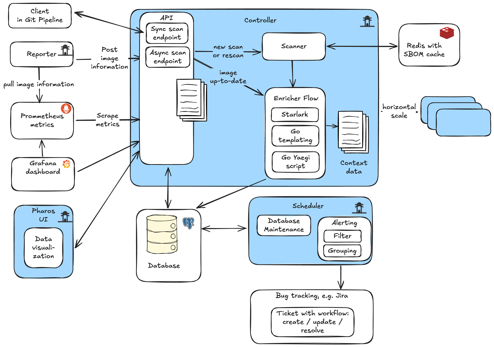
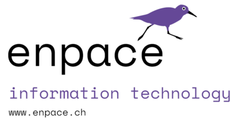

# Pharos

## What is Pharos?

Pharos is an open-source platform designed to automate the security scanning, vulnerability management and compliance reporting.

It pull running containers from Prometheus, enriches data with contexts important for the deployments, provides information on Grafana dashboards and creates tickets, based on the rules defined by the organization.

Contexts enrichments and rules are highly customizable using plugins, which could be written as go scripts using [Yaegi](https://github.com/traefik/yaegi), python like language using [Startlark](https://github.com/google/starlark-go/blob/master/doc/spec.md) or [go templates](https://pkg.go.dev/text/template).

## Installation

## Helm Chart

See [helm chart](../helm/pharos/) how to install pharos via helm chart.

## Grafana

Import the [dashboard](./grafana/pharos-dashboard.json) into your Grafana installation

Create datasources for Pharos:

- Type: Infinity
- Name: The namespace where it runs in
- Base URL: The URL defined by the [ingres in values.yaml](./helm/pharos/values.yaml)

## Usage

In addition Pharos can be executed as a cli tool for following tasks:
- Testing plugins
- Packaging plugins for the deployments

## Support

This project is under patronage of

