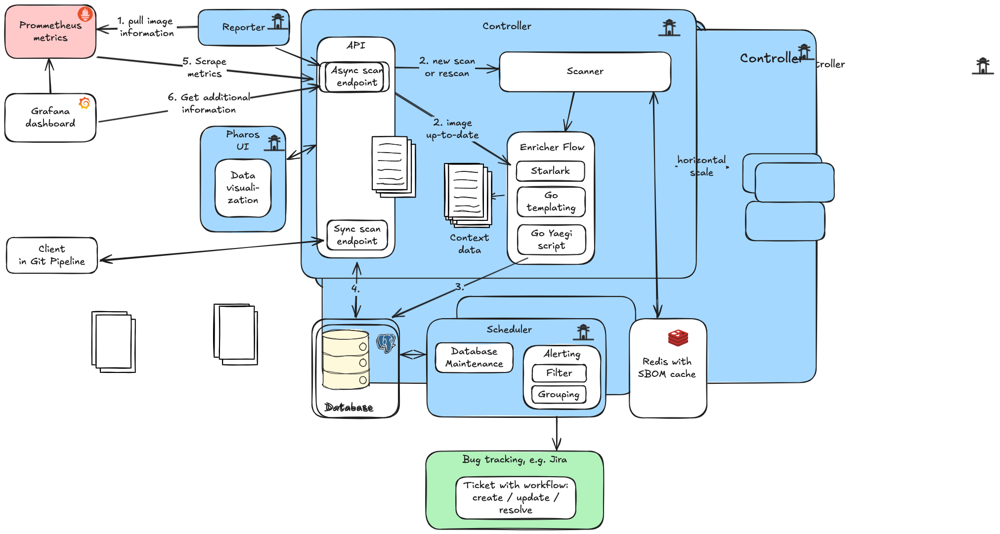

# Pharos: Automated Container Image Security and Compliance Platform

## Abstract

Pharos is an open-source platform designed to automate the security scanning, vulnerability management, and compliance reporting of container images in modern DevOps environments. It integrates with CI/CD pipelines, *Kubernetes* clusters, and monitoring tools to provide real-time insights into image security, streamline vulnerability remediation, and helps support regulatory compliance.

## Introduction

Containerization has revolutionized software deployment, but it introduces new security challenges. Vulnerabilities in container images can propagate rapidly across environments. Pharos addresses these challenges by providing a scalable, automated solution for scanning, reporting, and managing container image security.

## Architecture Overview

Pharos is built in Go and leverages a modular architecture:



- **Core Components**: 
    - Controller handles API,scanning, enrichment,
    - Prometheus reporter, handles submission of images
    - Scheduler handles database maintenance and submission of alerts.
- **Supported Scanners**: Integrates with *Grype* and *Trivy* for vulnerability analysis.
- **Deployment**: Designed to run on *Kubernetes*, with Helm charts for simplified installation and management.
- **Extensibility**: Custom enrichers/mappers, plugin support, and integration with external systems.

## Key Features
### Open Source

Pharos is open source, new features can be added or bugs addressed by the community.

### Automated Image Scanning

All scan requests are processed through the Pharos Controller, which orchestrates vulnerability analysis and compliance checks using *Grype* or *Trivy*.

### Queue-Based Processing

Scan requests are queued for scalable, asynchronous task management, ensuring efficient handling of large volumes of images.

### Comprehensive REST API

Pharos provides endpoints for submitting scan tasks, retrieving results, and integrating with external systems, enabling seamless automation and integration.

### Scalability

The Controller with Scanner and REST API components can be scaled horizontally to meet increasing demands in large environments.


### Real-Time Reporting

Prometheus integration enables real-time metrics collection, with Grafana dashboards available for visualization and monitoring.


### Extensible Enrichment

Enrichers using Go Templating, Starlark scripts, or Yaegi Go scripting enrich image context.

Example for enrichers usage:

- Calculation of EOS (End-Of-Support) Date
- Setting of owner, to automatically assign tickets to teams or persons
- Setting of CMDB IDs by calling the CMDB's API or using files.
- Waiving of vulnerabilities or images
- Summarize data (see below)

The following example shows how we can summarize vulnerabilites with a simple Starlark script:

```python
#!/usr/bin/env star

# Example return summary of findings
def enrich(input):
    data = input.payload
    severity_01_critical = 0
    severity_02_high = 0
    severity_03_medium = 0
    severity_04_low = 0
    severity_05_negligible = 0
    for finding in data.Image.Findings:
        if finding.Severity == "Critical":
            severity_01_critical += 1
        elif finding.Severity == "High":
            severity_02_high += 1
        elif finding.Severity == "Medium":
            severity_03_medium += 1
        elif finding.Severity == "Low":
            severity_04_low += 1
        elif finding.Severity == "Negligible":
            severity_05_negligible += 1
    alerted = False
    if severity_01_critical > 0 or severity_02_high > 0:
        alerted = True # We only create tickets if critical or high severities are found.
    # Return data
    return { 
        "Severity01Critical": severity_01_critical,
        "Severity02High": severity_02_high,
        "Severity03Medium": severity_03_medium,
        "Severity04Low": severity_04_low,
        "Severity05Negligible": severity_05_negligible,
        "Alerted": alerted
    }
```

### Alerting & Integration

Scan results can trigger alerts via webhooks, including automated *Jira* ticket creation for detected vulnerabilities. *Jiralert* is included as an optional component to simplify ticket management.

- No need for prometheus or alertmanager to fire alerts.
- Simplifies alerting, workflows and ticket creation.

Labels added by the enrichment process are added to the alert. 

Example of *Jira* Ticket created with enriched Data from above.


## Deployment

Examples for helm deployment are included, this also includes optionally the creation of *Jira* tickets via *Jiralert*

## Roadmap and future enhancements

- Modern Web UI to manage images, enrichers, create reports and manually waiving images.

